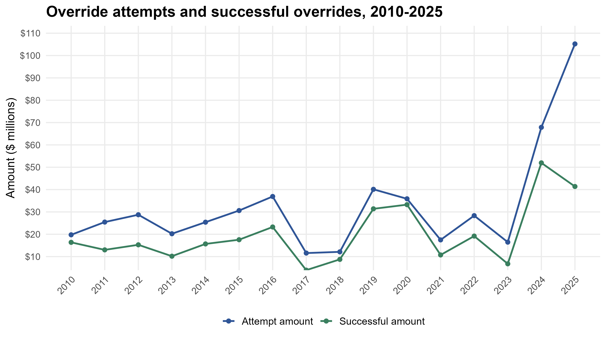
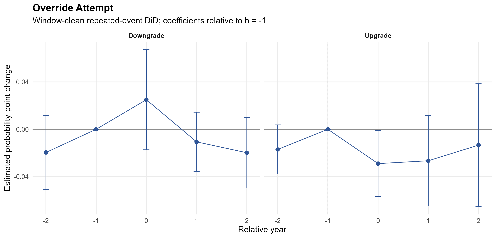
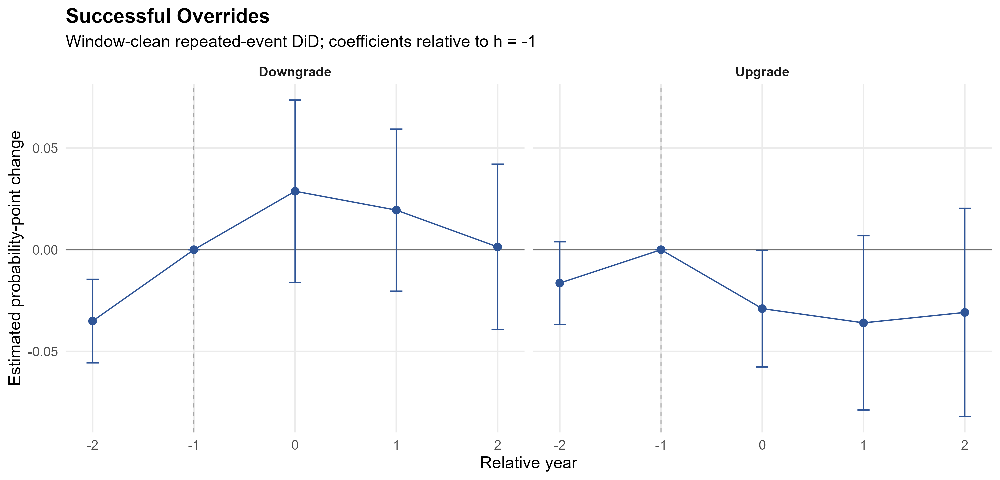
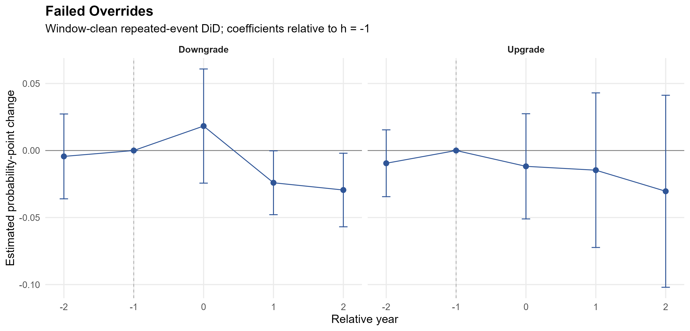

# Motivation

## Background

-   Driven by concerns over government expansion and increasing tax burdens, **Tax and Expenditure Limits (TELs)** act as institutional constraints on local governments’ ability to raise revenues and expenditures (Brennan & Buchanan, 1980).
-   TELs commonly restrict property tax growth but often reduce fiscal flexibility needed to respond to shocks (Joyce & Mullins, 1991; Jimenez, 2018).
-   With rising inflation, increasing service costs, and uncertainty surrounding federal and state aid, local governments face significant fiscal challenges.
-   Municipal governments in Massachusetts use tax overrides as voter-approved mechanisms to allow temporary tax increases above the property tax limits (Bradbury, Mayer, & Case, 2001).
-   Overrides represent a collective decision-making process between governments and voters under fiscal constraints.

## Massachusetts Proposition 2½

-   A Tax and Expenditure Limit passed by Massachusetts voters in 1980.
-   Primarily limits local property taxes through two caps:
    -   **Levy ceiling:** total taxes cannot exceed 2.5% of a community's total assessed property value.
    -   **Levy limit:** annual property tax revenue growth is capped at 2.5%, plus allowances for new growth.
-   Includes voter-approved overrides that allow communities to exceed the limits temporarily for specific needs.
-   Provides the institutional setting for studying how governments seek voter support for tax increases and how such efforts affect fiscal outcomes.

## Override Amounts in Massachusetts Municipalities

{width=100%}

## Research Questions

1.  What is the impact of municipal tax overrides on municipal credit ratings?

2.  How do municipal tax overrides influence subsequent voter support for tax increases?

# Framework

## Dual-Signal Framework

-   Override actions convey complex, potentially contradictory signals to rating agencies regarding fiscal health and governance capacity.
-   A simple "good" or "bad" assumption is insufficient to capture override signals.
-   The dual-signal framework explicitly acknowledges this tension:
    -   Overrides may signal fiscal flexibility and political capacity.
    -   Overrides may also signal fiscal stress or weak fiscal discipline.

## Positive Signal of Overrides

-   Overrides can signal fiscal strength and effective governance to credit markets.
-   Initiatives signal proactive governance and internal consensus even before passage.
-   Successful overrides demonstrate enhanced fiscal capacity and political capital, both valued by rating agencies.
-   **H1a:** Property tax override initiatives (attempts) positively affect municipal credit ratings.
-   **H1b:** Successful tax overrides positively affect municipal credit ratings.

## Negative Signal of Overrides

-   The need for an override can signal underlying fiscal stress or mismanagement.
-   It may reveal revenue insufficiency, a primary indicator of fiscal distress (Jimenez, 2018).
-   Observers may perceive override requests as weak fiscal discipline rather than as responses to external pressures.
-   Increased perceived default risk is typically penalized by credit markets.
-   **H2a:** Property tax override initiatives (attempts) negatively affect municipal credit ratings.
-   **H2b:** Failed tax overrides negatively affect municipal credit ratings.

## Political Consequences of Frequent Overrides

-   Repeated requests can erode trust and increase voter skepticism about government efficiency.
-   This may mobilize opposition and lower future override success rates.
-   Credit markets assess long-term stability, so persistent tax fatigue may signal heightened political risk.
-   Reduced political capacity implies less future fiscal flexibility when overrides are needed.
-   **H3a:** Frequent overrides and high total override amounts negatively correlate with citizens' support for future tax increases.
-   **H3b:** Frequent overrides negatively correlate with credit ratings.

# Data and Design

## Data and Samples

-   **Moody's ordered probit complete cases:** 265 municipalities, 2003-2015, 2017, and 2019-2021.
-   **Constructed regression panel:** 351 municipalities, 2003-2021.
-   **Repeated-event DiD:** clean override-event years from 2005-2019, stacked panel years from 2003-2021.

## Outcomes Variables and Treatments

-   **Rating outcome:** `Rating_ordered`, the ordered Moody's rating score.
-   **Voter-support outcome:** yes votes as a percentage of total votes in a municipality-year.
-   **Repeated-event rating-change outcomes:**
    -   `rating_downgrade`
    -   `rating_upgrade`
-   **Override measures:**
    -   Attempt, success, and failure indicators for rating models.
    -   Annual and three-year cumulative attempt, success, and failure counts for yes-vote-percentage models.
-   **Controls:** population size, debt burden, unemployment, revenue stability, revenue per capita, excess levy capacity, fiscal reserves, and budget balance.

## Main Rating Model: Ordered Probit with Mundlak Controls

$$
Rating\_ordered_{it}^{*}
= \alpha_1 Overrides_{it} + X_{it}\gamma
+ \overline{X}_{i}\theta +
+ \delta_t + \varepsilon_{it}
\tag{1}
$$

-   Ordered probit maps the latent rating index to the observed Moody's rating categories.
-   The Mundlak approach (Greene, 2004; Wooldridge, 2010) includes the time-averaged values of each time-varying predictor for each municipality to partially approximate municipality fixed effects
-   Overrides include attempt, success, and failure indicators.
-   Standard errors are clustered by municipality.

## Voter-Support Model: Two-way Fixed Effects

$$
Support\_percent_{it}
= \alpha_1 Frequency_{it} + X_{it}\gamma
+ \mu_i + \delta_t + \varepsilon_{it}
\tag{2}
$$

-   `Frequency` is annual or three-year cumulative override activity (attempts, successes, failures).
-   Municipality fixed effects absorb time-invariant local differences.
-   Year fixed effects absorb common statewide shocks.
-   Standard errors are clustered by municipality.

## Repeated-Event DiD Design

$$
\begin{aligned}
Rating\_change_{ist}
= {} & \sum_{h \ne -1} \beta_h
1[rel\_year_{ist}=h] \times Treated_{is} \\
& + \eta_{si} + \tau_{st} + \varepsilon_{ist}
\end{aligned}
\tag{3}
$$

-   Event types: override attempts, successful overrides, and failed overrides.
-   Event window: $h = -2, -1, 0, 1, 2$ with $h=-1$ as the reference year.
-   The primary comparison pool uses window-clean controls with no override event within the event window.
-   Fixed effects: stack-by-municipality and stack-by-year.
-   Standard errors are clustered by municipality.

## Repeated-Event DiD Stacks

-   Each clean treated event creates one event-centered stack.
-   A stack includes one treated municipality-event plus all window-clean control municipalities observed in the same event window.
-   Window-clean stacks:
    -   Override attempts: 200 stacks; median 201 municipalities per stack.
    -   Successful overrides: 176 stacks; median 247 municipalities per stack.
    -   Failed overrides: 144 stacks; median 258 municipalities per stack.
-   Municipalities can appear in multiple stacks when they are eligible controls for multiple clean events.

# Results

## Overrides and Moody's Ratings

-   Override attempts and successful overrides are positively associated with ordered Moody's ratings.
-   Failed overrides have a small, imprecise association in the active ordered probit models.
-   These estimates use controls, Mundlak means, year indicators, and municipality-clustered standard errors.

\input{../outputs/tables/northeast_moodys_main.tex}

## Annual Override Frequency and Yes Votes

-   More annual operating override attempts are associated with lower yes-vote percentages.
-   Annual successful override counts are positively associated with yes-vote percentages.
-   Annual failed override counts are negatively associated with yes-vote percentages.
-   Models use municipality and year fixed effects.

\input{../outputs/tables/northeast_vote_share_annual.tex}

## Three-Year Override Frequency and Yes Votes

-   Three-year cumulative attempts are negative but imprecise.
-   Three-year cumulative successes are positively associated with yes-vote percentages.
-   Three-year cumulative failures are negatively associated with yes-vote percentages.
-   Models use municipality and year fixed effects.

\input{../outputs/tables/northeast_vote_share_cumulative.tex}

## Repeated-Event Sample Construction

-   Clean treated events have no nearby same-type event inside the local event window.
-   The design compares treated events with window-clean controls.
-   Event-year estimates compare rating-change outcomes to $h=-1$ within each stack.

\input{../outputs/tables/northeast_repeated_event_counts.tex}

## Binary Rating-Change DiD Results

-   Event-year upgrade estimates are negative for override attempts and successful overrides.
-   Event-year downgrade estimates are positive for attempts and successes but imprecise.
-   Failed-event post-period downgrade estimates are negative in years $h=1$ and $h=2$.
-   Overall, the binary rating-change DiD evidence is mixed and should be read as a robustness design.

\input{../outputs/tables/northeast_repeated_event_did_main.tex}

## Event Study: Override Attempts

\vspace{-0.15cm}

-   Upgrade probability falls in the event year; downgrade estimates are imprecise.

{width=100%}

## Event Study: Successful Overrides

\vspace{-0.15cm}

-   Upgrade probability falls in the event year; downgrade estimates remain imprecise.

{width=100%}

## Event Study: Failed Overrides

\vspace{-0.15cm}

-   Post-event downgrade estimates are negative in $h=1$ and $h=2$, suggesting fewer additional downgrades relative to $h=-1$. This may mean that rating agencies may already observe fiscal problems before the failed vote.

{width=100%}

## Summary of Findings
-   Credit rating models show positive associations for attempts and successes, with no clear rating association for failures.
-   Voter support models suggest repeated attempts and failures are associated with lower voter support, while successful histories are associated with higher yes-vote percentages.
-   Repeated-event DiD models with binary downgrade and upgrade outcomes provide mixed short-window evidence around override events.

## Discussion and Conclusion
-   The findings suggest that tax overrides are a double-edged fiscal tool, with potential benefits and costs that vary depending on their frequency and success.
-   Under what conditions do overrides become a viable strategy for local governments to cope with fiscal challenges and signal fiscal resilience without eroding political support?
-   To what extent do override mechanisms reinforce existing fiscal inequalities across communities?
-   In the context of declining federal and state aid and rising service costs, how can TELs balance fiscal discipline with necessary flexibility?

## Thank You

Thank you for your attention.

\vspace{0.5cm}

Tingli Qu (tq1939a\@american.edu)

Yuzhu Li (yli92\@albany.edu)

Gang Chen (gchen3\@albany.edu)
